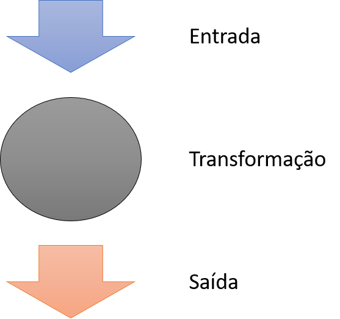
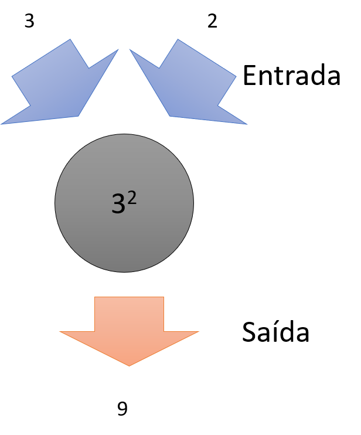
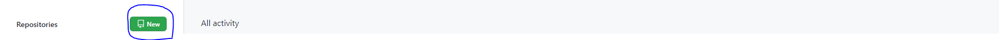
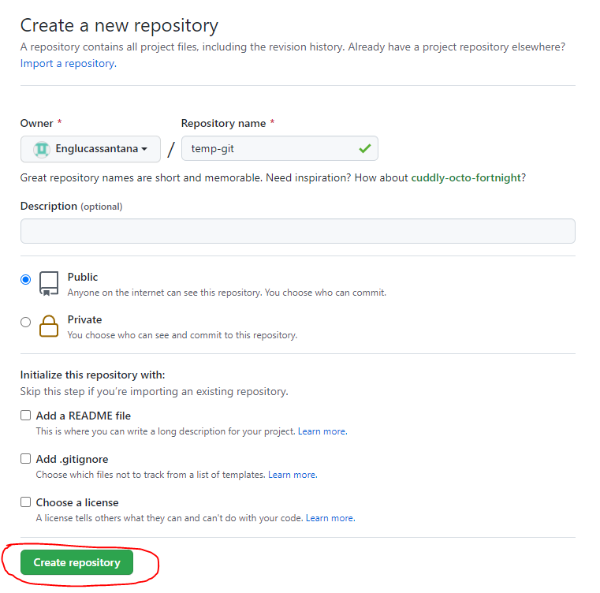
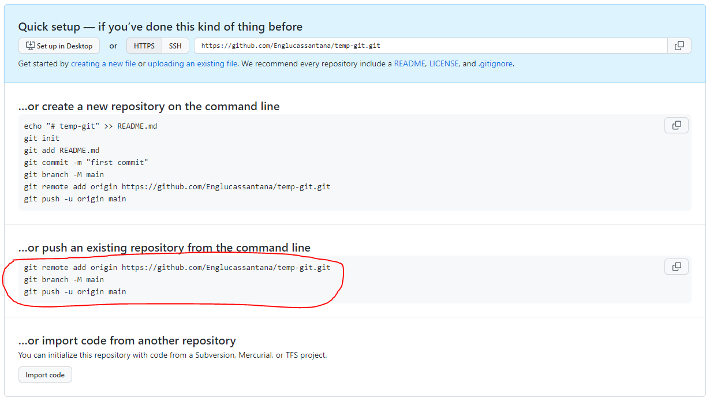
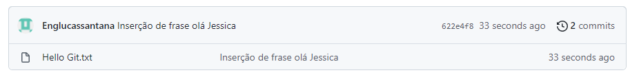

# Algoritmos & JavaScript
## Funções
Uma função é um agrupamento de uma série de _statements_ que juntos são destinados a executar uma tarefa.

Uma função pode ser **reusada** repetidas vezes em um _script_. Sendo que todas as vezes que a função for usada será repetidos os mesmo _statements_.

As funções podem são reusadas em um _script_ todas vez que ela for **chamada** e para que uma função seja chamada é necessário que a função tenha um **nome**.

Para fazer a chamada de uma função em `javascript` é necessário usar o nome da função acompanhado de parenteses:

```Javascript
sayMyName();
```
O exemplo mostrado chama uma função de nome `sayMyName`.

Para que uma função ser chamada é necessário que antes ela seja declarada. Em `javascript` declara-se uma função usando a _keyword_ `function`, o nome da função e parenteses:
```javascript
function sayMyName(){
  document.write('Lucas');
}
```
A função acima escreve em uma pagina html o nome Lucas.

Funções vão muito além do que apenas repetir _statements_. Com funções é possível processar dados.

A forma que mais acho util em se criar funções é imaginar como um modelo de entrada-transformação-saída.



Para ficar mais nítido o que estou querendo dizer, imagine uma calculadora, onde você digita as operações, a calculadora processa e apos o processamento a calculadora mostra o resultado da operação.

O ato de digitar é equivalente a uma *entrada*. O processamento da calculadora é equivalente a uma *transformação*, note que na transformação você não precisa saber de detalhes de como a calculadora está executando a operação solicitada. O ato de mostrar o resultado é equivalente a uma *saída*.



Para ficar mais visível o uso entrada e saída vamos ver a chamada de uma função que calcula o volume de um tanque de água a partir de duas entrada o raio e a altura do tanque:
```javascript
let radiusValue     = 2;
let heightValue     = 3;
let tankVolume = calculateTankVolume(radiusValue, heightValue);
```
Você consegue identificar o nome da função no exemplo acima? Acertou, se disse `calculateTankVolume`.

Você deve ter observado que na chamada da função `calculateTankVolume`, entre os parenteses, temos duas variáveis. Os valores atribuídos as estas variáveis estão sendo usadas como a entrada da função. 

> [!IMPORTANT]
> As entradas de uma função são colocadas entre parenteses e são chamada de **argumentos** da função.

O valor de saída da função `calculateTankVolume`, no exemplo, está sendo armazenado na variável `tankVolume`.

COmo já sabemos que para uma função ser chamada é necessário que ela seja declarada vamos ver como a função `calculateTankVolume` processa (transforma) as duas entradas:

```javascript
function calculateTankVolume(radius,height){
  let cylinderVolume = Math.PI*radius**2*height;
  return cylinderVolume;
}
```
Na declaração as variáveis dentro dos parenteses são representações da entrada e os valores são alimentados quando a a chamada da função.

> [!IMPORTANT]
> As variáveis postas dentro do parenteses no momento da declaração são chamadas de **parâmetros** da função.

Na declaração da função, observe o _statement_ `return cylinderVolume;`, este _statement_ é responsável por fornecer a saída da função, que para a função  `calculateTankVolume` a saída é o resultado do calculo do volume do tanque.

> [!IMPORTANT]
> A saída de uma função é conhecida como **retorno** da função.

## Git

Para iniciar um repositório _git_ em seu computador é necessário abrir um terminal com o git configurado ou usar o `git bash`:

1. Acessar o diretório do seu projeto;
1. Clicar com o botão direito do mouse;
1. Selecionar `git bash`;

Com o `git bash` aberto vamos *iniciar um repositório*, digite:
```powershell
git init
```
Isso cria um novo diretório chamado `.git` que comportar os arquivos necessários para o repositório.

Com isso, tudo que estiver no diretório do seu projeto começará a ver rastreado. Vamos ver os arquivos que estão sendo rastreados pelo git?

```powershell
git status
```
Você deve está vendo algo mais ou menos dessa forma, caso o diretório no qual você criou o repositório tenha arquivos:

```powershell
On branch master

No commits yet

Untracked files:
  (use "git add <file>..." to include in what will be committed)
        Hello Git.txt

nothing added to commit but untracked files present (use "git add" to track)
```
No caso acima, a saída está informando que não há arquivos que receberam `commit`. Além disso, está  mostrando que há um arquivo que não está sendo rastreado e a própria mensagem informa o que fazer para que o arquivo comece a ser rastreado.

Vamos adicionar esse arquivo ao rastreamento e verificar o _status_ através dos comandos:
```powershell
git add Hello\ Git.txt
git status
```
A saída do status ficará da seguinte forma:
```powershell
On branch master

No commits yet

Changes to be committed:
  (use "git rm --cached <file>..." to unstage)
        new file:   Hello Git.txt
```
A mensagem de saída diz que há mudanças no arquivo rastreado e que elas podem passar por _commit_, que é a criação de uma nova versão para o arquivo.

Para fazer o _commit_ temos que usar o comando:
```powershell
git commit -m "Meu primeiro commit"
```
A primeira versão do arquivo foi criada.

Vamos entender o comando usado para o _commit_. Iniciamos com o `git commit` o `-m` indica que a mensagem associada ao commit irá ser digitada no próprio terminal. Entre aspas digitamos a mensagem referente a versão criada.

Caso você não use o `-m` no comando para o _commit_ um editor de previamente configurado irá ser aberto e você terá que digitar a mensagem da versão nesse editor de texto.

Vamos agora importar nossos arquivos para o github.

1. Clique em `New`:

2. Digite o nome que você deseja fornecer ao repositório e clique em `Create repository`:

3. Copie e cole o código abaixo de "…or push an existing repository from the command line" no git bash.

Uma mensagem parecida com essa deve aparecer como saída:
```powershell
Enumerating objects: 3, done.
Counting objects: 100% (3/3), done.
Writing objects: 100% (3/3), 224 bytes | 224.00 KiB/s, done.
Total 3 (delta 0), reused 0 (delta 0), pack-reused 0
To https://github.com/Englucassantana/temp-git.git
 * [new branch]      main -> main
Branch 'main' set up to track remote branch 'main' from 'origin'.
```
Toda vez que você quiser criar uma versão nova você terá que:
1. Adicionar o arquivo modificado ao rastreamento;
1. Fazer o _commit_ com uma mensagem;]
1. Enviar o arquivo para o github.
Veja a sequência de comandos:
```powershell
git add ./Hello\ Git.txt
git commit -m "Inserção de frase olá Jessica"
git push
```
Veja como os commits aparecem no github:

## Estruturas de repetição
Uma estrutura de repetição são códigos que rodam um bloco de código em loop.

Toda estrutura de repetição tem uma condição para quebrar o loop.

As três principais estruturas de repetição são:
1. while

```javascript
while(condição){
  //statements
}
```
2. for
```javascript
for(inicialização;condição;iteração){
  //statements
}
```
3. do... while
```javascript
do{
  //statements
}while(condição)
```

Em aplicações de alto nível é raro o uso das estruturas `while` e `do... while`.

Para melhorar a compreensão da estrutura de repetição `for` vamos pensar em um problema.

Você tem um vetor de números com cinco posições e você precisa adicionar o valor sete a cada uma das posições do vetor. Isso é facilmente resolvido com a estrutura `for` da seguinte maneira:
```javascript
for(let i = 0; i < 5; i = i + 1){
  arrayOfNumbers[i] = arrayOfNumbers[i] + 7;
}
```
A estrutura de repetição `for` tem três partes:
  na *primeira parte*, inicializamos uma variável `i` com o valor `0`;
  na *segunda parte*, estabelecemos a condição de quebra do loop, ou seja, quando a variável `i` chegar ao valor `5`;
  na *terceira parte*, foi estabelecido um incremento na variável `i` que é feito apenas quando o bloco de código entre chaves é completamente executado.

O bloco de código entre a chaves é executado cinco vezes antes. Na sexta vez o loop é quebrado pois a variável `i` atinge a condição de parada.

O código anterior pode ser rescrito da seguinte forma:

```javascript
for(let i = 0; i < arrayOfNumbers.length; ++i){
  arrayOfNumbers[i] = arrayOfNumbers[i] + 7;
}
```
Os vetores em javascript são objetos e tem uma propriedade chamada length que retorna o tamanho do vetor, que no exemplo é cinco. O incremento em um pode ser substituído por `i++` ou `++i` que são formas concisa de escrever `i = i + 1`.
## Array
Um _array_ é um tipo especial de variável que ao invés de armazenar apenas um valor ela armazena uma lista de valores.

Para declarar um _array_ é usando a _keyword_ `let` seguida do nome que deseja fornecer ao _array_ usar o operador de atribuição e posteriormente abrir e fechar colchetes.

```javascript
let arrayOfNumbers = [];
```
Na declaração do array valores pode ser inicializados:
```javascript
let arrayOfNumbers = [1,7,345];
```
O _array_ declarado acima tem três posições, ou seja, ele guarda três valores.

Em javascript os array são *objetos* e objetos tem propriedade e métodos, e isso muitos desses métodos podem facilitar o dia a dia do programador. um exemplo de propiedade bastante util é a propriedade `length`que retorna o tamanho do _array_.

```javascript
let arrayOfNumbers = [1,7,345];
let arraySize = arrayOfNumbers.length;
// o retor da propriedade length para o caso acima é três.
```
Para acessar um valor de uma posição do _array_ basta usar o nome do _array_ acompanhado do sua posição entre colchetes.

```javascript
let arrayValue = arrayOfNumbers[1];
// o valor retornado pelo statement acima é 7 já que o arrayOfNumbers na posição 1 tem valor amazenado 7
```
> [!IMPORTANT]
> _Arrays_ iniciam na posição zero.